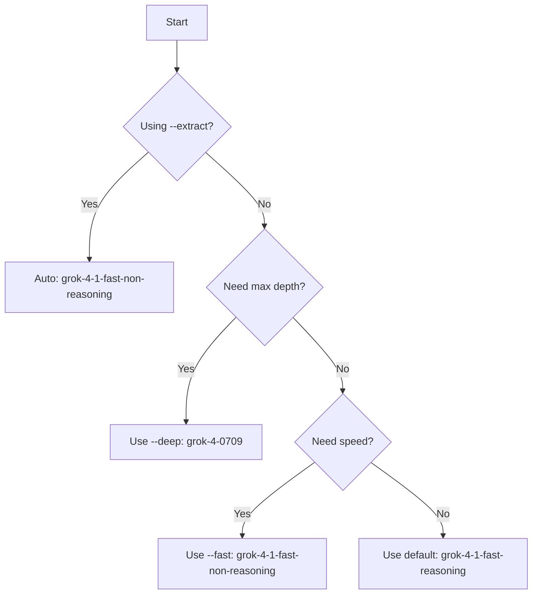

## Available Models

`/grok-x` supports three Grok-4 models. Choose based on latency, depth, and cost requirements:

| Flag | Model | Use when |
|------|-------|----------|
| **(none)** | `grok-4-1-fast-reasoning` | Default — complex analysis |
| `--fast` | `grok-4-1-fast-non-reasoning` | Quick lookups, simple searches |
| `--deep` | `grok-4-0709` | Maximum depth, higher cost |
| `--extract` | `grok-4-1-fast-non-reasoning` | Auto-selected — required for structured output with tools |

<Info>
  You can set a custom default model using the `GROK_X_DEFAULT_MODEL` environment variable in `~/.claude/settings.json`. If omitted, the skill defaults to `grok-4-1-fast-reasoning`.
</Info>

---

## Model Comparison

<CardGroup cols={3}>
  <Card title="Default" icon="circle-check">
    ### grok-4-1-fast-reasoning
    
    **The balanced choice.** Uses extended reasoning to produce thorough, well-organized analysis.
    
    **Best for:**
    - Open-ended research
    - Complex questions
    - Multi-step analysis
    - `--web` and `--analyze` modes
    
    **Characteristics:**
    - Moderate latency
    - High quality
    - Good cost/performance ratio
    
    **Example:**
    ```bash
    /grok-x "What is happening with AI regulation on X?"
    ```
  </Card>
  
  <Card title="Fast" icon="bolt">
    ### grok-4-1-fast-non-reasoning
    
    **The speed choice.** Non-reasoning variant with significantly lower latency and cost.
    
    **Best for:**
    - Simple lookups
    - Quick quote pulls
    - Time-sensitive queries
    - `--extract` mode (auto-selected)
    
    **Characteristics:**
    - Lowest latency
    - Lower cost
    - No extended reasoning chain
    
    **Example:**
    ```bash
    /grok-x "What did @naval post today?" --fast
    ```
  </Card>
  
  <Card title="Deep" icon="microscope">
    ### grok-4-0709
    
    **The flagship choice.** Maximum analytical depth for complex topics.
    
    **Best for:**
    - Geopolitical analysis
    - Dense technical topics
    - When reasoning chain matters
    - High-stakes research
    
    **Characteristics:**
    - Highest latency
    - Highest cost
    - Maximum depth
    
    **Example:**
    ```bash
    /grok-x "Comprehensive analysis of the tariff debate on X" --deep --web --images --citations
    ```
  </Card>
</CardGroup>

---

## When to Use Each Model

### Default: `grok-4-1-fast-reasoning`

**Use this when:**
- Quality matters more than speed
- The query requires multi-step reasoning
- You're combining tools (`--web`, `--analyze`)
- You need well-structured, thorough analysis

**Examples:**

```bash
# Cross-platform research
/grok-x "Are there signs of a chip export control reversal?" --web --citations

# Data analysis
/grok-x "Tech layoff announcements this month" --analyze --from 2026-02-01

# Handle monitoring with context
/grok-x "What has @atrupar posted about this week?" --handles atrupar --from 2026-02-25
```

**Output quality:** High. The model uses extended reasoning to organize findings, identify patterns, and structure analysis.

---

### Fast: `grok-4-1-fast-non-reasoning` (with `--fast`)

**Use this when:**
- You need results in seconds, not tens of seconds
- The query is straightforward
- You're doing quick lookups or quote pulls
- Cost optimization is a priority

**Examples:**

```bash
# Quick lookup
/grok-x "What did @naval post today?" --fast

# Simple quote pull
/grok-x "Latest @elonmusk tweet about SpaceX" --fast

# Fast handle monitoring
/grok-x "@pmarca recent posts" --handles pmarca --fast
```

**Output quality:** Good for simple queries. Less structured than default, but significantly faster.

<Tip>
  The `--fast` flag is also **auto-selected** when using `--extract`. Structured output with tools requires a non-reasoning model.
</Tip>

---

### Deep: `grok-4-0709` (with `--deep`)

**Use this when:**
- Maximum analytical depth is required
- The topic is complex (geopolitics, dense technical subjects)
- The reasoning chain itself matters
- You're willing to pay higher cost and wait longer

**Examples:**

```bash
# Complex geopolitical analysis
/grok-x "Comprehensive analysis of the tariff debate on X" --deep --web --images --citations

# Dense technical topic
/grok-x "xAI Responses API developer feedback" --deep --web

# High-stakes research
/grok-x "AI safety discourse" --deep --handles karpathy,ylecun,sama
```

**Output quality:** Maximum. The flagship model delivers the most thorough reasoning chains and deepest analysis.

<Warning>
  **Higher cost and latency.** Only use `--deep` when the default model isn't sufficient. For routine searches, stick with the default.
</Warning>

---

## Automatic Model Selection: `--extract`

**The `--extract` flag automatically selects `grok-4-1-fast-non-reasoning`**, regardless of `--fast` or `--deep`.

**Why?** Structured output with tools requires a non-reasoning Grok-4 variant. This is an xAI API constraint.

**Examples:**

```bash
# Sentiment extraction (auto-selects fast non-reasoning)
/grok-x "Bitcoin sentiment on X right now" --extract sentiment

# Timeline extraction (auto-selects fast non-reasoning)
/grok-x "xAI product announcements in the last 90 days" --extract timeline --from 2025-12-01

# Claims extraction (auto-selects fast non-reasoning)
/grok-x "Claims being made about AGI on X" --extract claims --from 2025-01-01 --web
```

<Info>
  You cannot override this behavior. `--extract` always uses `grok-4-1-fast-non-reasoning` for schema compliance.
</Info>

---

## Setting a Custom Default

You can override the default model (`grok-4-1-fast-reasoning`) by setting `GROK_X_DEFAULT_MODEL` in `~/.claude/settings.json`:

```json
{
  "env": {
    "XAI_API_KEY": "xai-your-key-here",
    "GROK_X_DEFAULT_MODEL": "grok-4-1-fast-non-reasoning"
  }
}
```

**Valid values:**
- `grok-4-1-fast-reasoning` (default)
- `grok-4-1-fast-non-reasoning` (fast)
- `grok-4-0709` (deep)

<Tip>
  The `--fast` and `--deep` flags **always override** the default, regardless of `GROK_X_DEFAULT_MODEL`.
</Tip>

---

## Decision Guide



**Quick reference:**

- **Simple lookup?** → `--fast`
- **Complex analysis?** → default (no flag)
- **Maximum depth?** → `--deep`
- **Structured output?** → `--extract` (auto-selects fast)

---

## Cost Considerations

<Note>
  Model costs are determined by xAI's pricing. As of March 2026:
  
  - `grok-4-1-fast-non-reasoning` is the most cost-effective
  - `grok-4-1-fast-reasoning` is moderately priced
  - `grok-4-0709` is the most expensive
  
  Check [console.x.ai/pricing](https://console.x.ai/pricing) for current rates.
</Note>

**Optimization tips:**

1. Use `--fast` for routine queries to reduce costs
2. Reserve `--deep` for high-value analysis
3. Combine `--fast` with date filters (`--from`, `--to`) to limit search scope
4. Use `--extract` when you need structured output — it's faster and cheaper than `--analyze`

---

## Next Steps

<Card title="Tool Combinations" icon="wand-magic-sparkles" href="/usage/tool-combinations">
  Learn how to combine models with different tool modes for optimal results
</Card>
